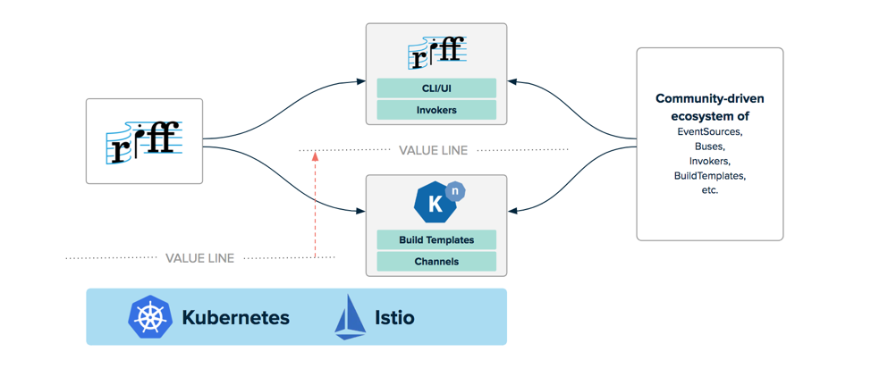

Howdy!

This week was a good week! Not only did I get to see the Toy Story 4-, Dumbo- AND Detective Pikachu-trailer; I also went to Devoxx Belgium.
For those who don't know what Devoxx is; Devoxx is a yearly Java conference consisting out of two Deep Dive days and three Conference days in Antwerp. 
During the first two days there are in depth talks/workshops about several topics such as AI, new Java-related frameworks and/or new languages. 
The other three days consist out of shorter sessions in order to get a foretaste of several topics and to see what is going on in the Java-world.
From those five days packed with mind-blowing stuff, I would like to present you the three most interesting ones in my opinion. 

# The rise of Kotlin

There was no way around this; Kotlin is gaining popularity. Since the 1.3 release with several new features such as coroutines, it seems the language is getting mature. Also the support with Spring is now optimized, thus meaning I can easily switch to Kotlin for my daily Spring Boot work. During several presentations I got to see several interesting features of the language. Data Classes for example are something extremely cool; it gets rids of all your typical POJO boilerplate code and removes all getters/setters/etc from your code. You even don't have to create a dedicated class file for it! Also pattern matching is a huge improvement; it removes all your ugly 'isintanceof' if-statements with clean when-statements. You can describe Kotlin as Scala for for newbies.

    when (x) {
        is Int -> print(x + 1)
        is String -> print(x.length + 1)
        is IntArray -> print(x.sum())
    }

However it seems that the new upcoming Java-versions will also support these features. I still need to figure out if it is worth switching now, or just wait for the upcoming Java 12-release.

# Functional Programming

Yeah, this topic is already quite some time hot. I already try to apply several FP techniques in my daily work, however I sometimes end up trapped in a corner. For example: checked exceptions in my functional map/filter flows. There were however two very interesting talks by [@BrianVerm](https://twitter.com/brianverm) and [@VictorRentea](https://twitter.com/VictorRentea) on this topic. They covered very recognizable scenarios in which I often get stuck (unless a colleague helps me) and how to solve/prevent them. I also learned that [Vavr.io](http://www.vavr.io/) is an awesome library with tons of functional utilities inside. Awesome!

# Knative and Riff

Kubernetes is cool. Istio is cool. So I guess Knative and Riff, which are built on top of these frameworks should also be awesome, right?! I attended a session by [@Saturnism](https://twitter.com/saturnism) explaining both. The session started with a hands-on demo in which Riff was installed and a function was deployed (the function was just a simple JavaScript file on github). Quite impressive; no configuration overhead, no complicated yaml files; just a simple deploy-command. The function also scaled automagically.

The Knative part was also explained in depth, however I have to be honest: some parts are still not 100% clear to me. Knative was built with three core concepts in mind: building, serving and eventing. The last part (eventing) seemed quite interesting. I guess some new Custom Resource Definitions got defined such as Routes, Channels and Subscriptions in order to make the eventing part straight-forward without having to connect the services/functions ad-hoc. I installed everything on my local Kubernetes-cluster and I am ready to start experimenting with it!

## Conclusion

There is no doubt about it: I enjoyed my week at Devoxx Belgium. There were a ton of other cool talks on the conference such as the one on Project Reactor or the talk on Chaos Engineering, but the three topics above seem the ones I can/will use in my daily work. 