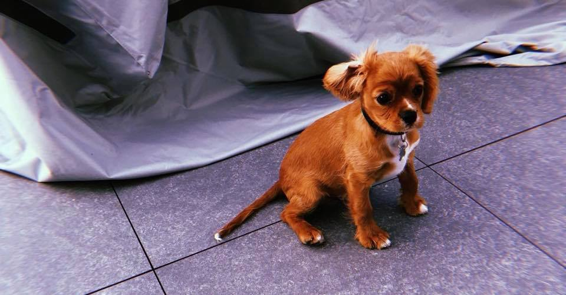
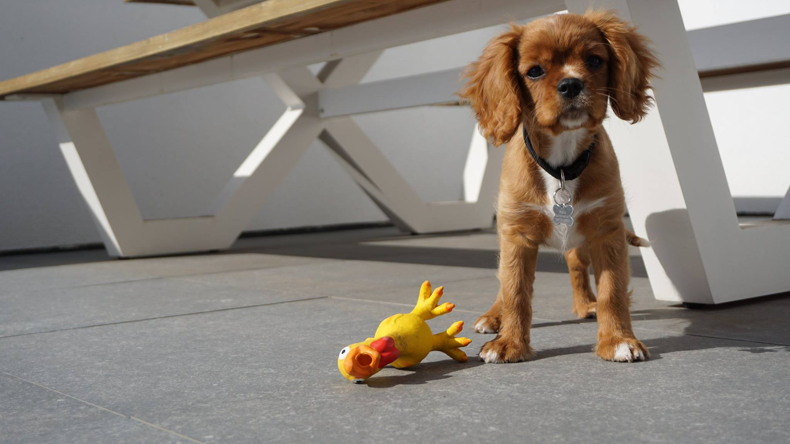
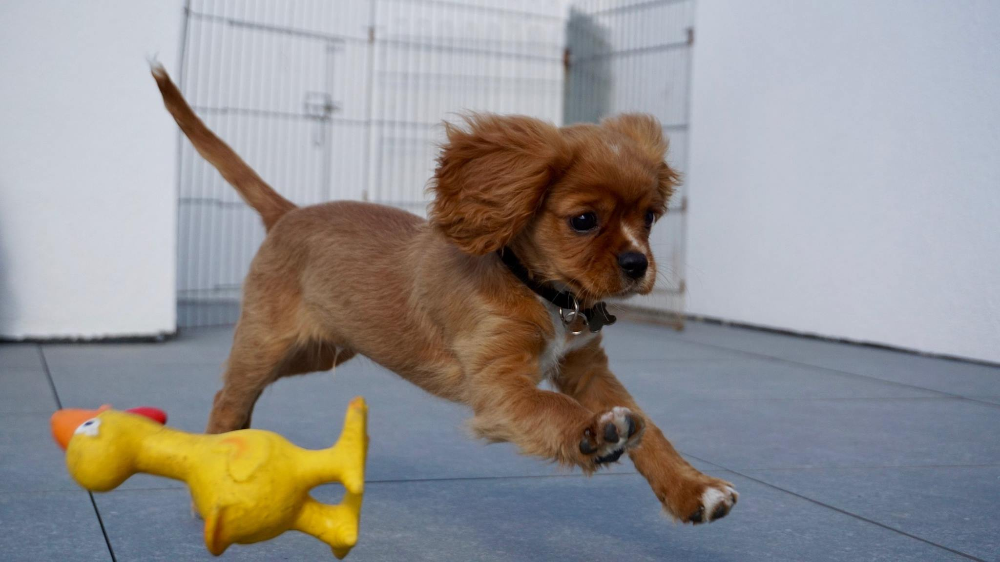
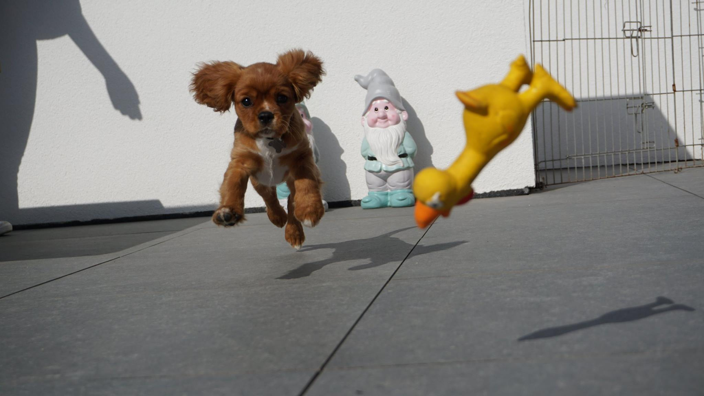

Hi there,

Today I would like to introduce you to Nalu, my new doggo best friend. 
As a child, I always wanted to have a dog. Unfortunately my parents didn’t share that same desire. When I went to university, I decided that when I was living on my own, I would buy an awesome doggo. After some discussions with my girlfriend (which was more of a cat person) we decided to buy a dog. Since we live on an apartment, the pool of dogs races to choose from was quite small. We stumbled however on the Cavalier King Charles Spaniel species, which seemed perfect for us; a rather small, intelligent and affectionate animal.

As I never owned a dog before, it was quite exciting for me to welcome my new four legged best friend. I read several books before the big arrival and had quite some tips of a friend of mine. On September 6, we drove to the puppy owner to get our doggo. The first day was very stressy for me; how would he spend his first night? Would he like our house? How should I react to bad/good behaviour? Once we arrived home, everything went pretty naturally; I just sat down with my little friend and watched some television. The first night I slept together with him in the living room; yes, we were going to be veeeery good friends!

The first month flew by. Since he was not yet vaccinated during the first weeks of his time in the apartment, we had to be very careful. We were told that we should not go walking because other dogs and rats (we live near a small river) could make him sick. Nalu was however very active, so keeping him inside wasn’t always that easy. He was getting quite frustrated and the parking ground downstairs felt pretty quick boring to him; why can’t I go play outside like the other doggo’s?

Tomorrow, Nalu is two months a part of our family and already four months old. Since he got his last vaccin, Nalu was allowed to walk outside which he liked a lot. We also decided to go to dog school. As the ‘real’ owner, I’m the one to accompany him to the classes twice a week. The exercises there are rather repetitive and sometimes even boring, however we are making a lot of progress. At the age of four months, I can honestly say Nalu is a clever doggo. The process of communicating to Nalu and Nalu communicating towards me, is some of the most interesting things I experienced in my life. Apart from the tips in books and magazines, there is a lot of gut feeling involved in the process. I’m rather a rational person, so that’s why the process is probably so interesting to me. The bonding between dog and owner is something you cannot learn on pluralsight or youtube tutorials.

On November 11 I live exactly one year together with my girlfriend in our apartment. In that year, we bought a lot of stuff, but I can honestly say Nalu was the best purchase of the last decade. I love my doggo so much and I I would not be able to miss him anymore. 